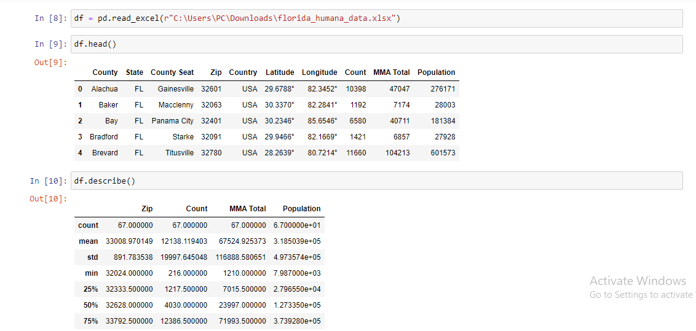
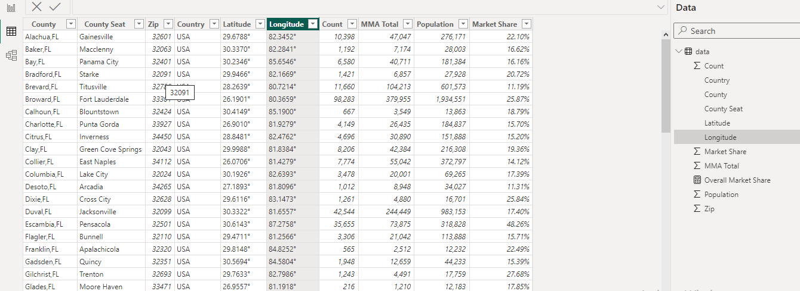
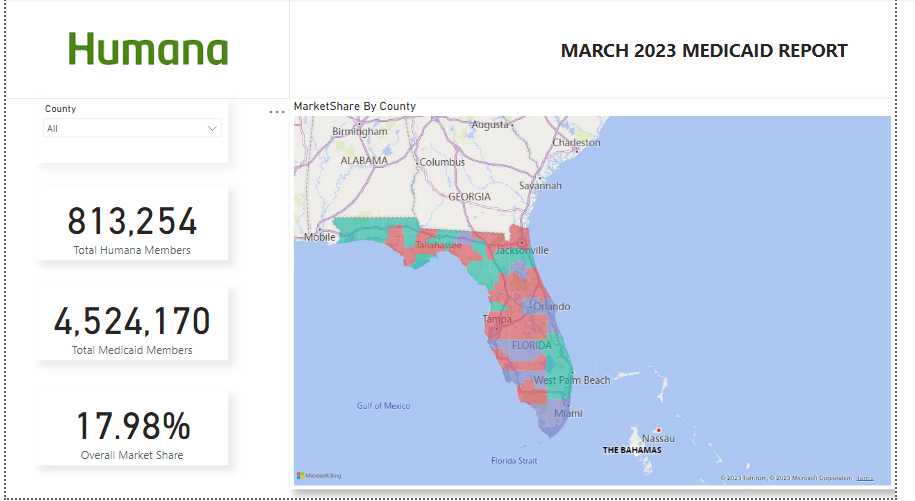

# HEALTHCARE_DATA_ANALYSIS-VISUALIZATION
### Introduction
Humana is a Medicare Advantage HMO, PPO and PFFS organization and
a stand-alone prescription drug plan with a Medicare contract in the state of florida.
And seeks to have an overview/ descriptives analysis of its operations within the state.

### Problem Statement 
The state of florida is a state of over 20 million people and Humana our client wants in clear simple terms to know
how its faring in the state based on its medicare service delivery, by eveluating its key performance indicators

After analytically examining the dataset, 3 questions needs to be answered.

1. How many people are using Medicare in the state?
2. How many people are using Humana medicare in the state ?
3. What is Humana's share of the market in the state of Florida ?

### Data Sourcing 
The data was collected from data.gov.

### Data Transformation
 
Data was imported into python. And i used the pandas library to clean the 
data by doing the following:
1. Identified and removed 9 missing values.
2. Identifying and removing the outliers

ScreenShot of my_Jupiter's_Note book

There after dataset was imported into Power BI for futher wrangling and transformation
The following processes where carried out on the data set:
1. The count and state column eas merged into one column and renamed as Location
2. A new column called market share was created which was derived by dividing the count column by the market share

   Screenshot of powerQuery in powerBI
   

### Data Visualization
The data was visualized with Power BI.
Clearly showing major KPI's

### Conclusion
1. There are 4,524,170 users of medicare in the state of Florida.
2. Humana has 813,254 users of its service in the state of Florida.
3. Humana controls 17.98% of the medicare market in the state of Florida
   

 
